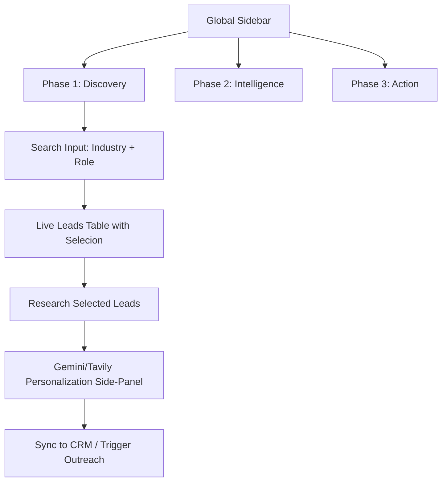

# 🌌 Proposed UI Redesign: Portal OG Command Center

The current dashboard is fragmented and lacks a clear progression. We will refactor it into a **Flow-Based Command Center** that follows the ICP-to-CRM pipeline.

## 🏗️ The New Visual Architecture

## 🎨 Key Visual Improvements

### 1. Glassmorphic Immersive View
- **Background**: `radial-gradient(circle at top right, #0c1222 0%, #050505 100%)`.
- **Cards**: `backdrop-blur-2xl bg-white/[0.03] border-white/5`.
- **Micro-animations**: Status badges with subtle glows and pulsing states for active processes.

### 2. The "Action Bar" (Bottom Fixed)
Instead of static buttons in each section, a **Floating Action Bar** will appear when leads are selected:
- `3 Leads Selected`
- `[ Research ]`
- `[ Personalize ]`
- `[ Sync to CRM ]`

### 3. Responsive Flow
- **Desktop**: 3-column "Terminal" view (Telemetry, Main View, Activity Feed).
- **Mobile**: Single-column stack with Tab-based navigation and a bottom Action menu.

## 🛠️ Redesign Strategy

1.  **Refactor `App.tsx`**: Break into smaller, focus-driven functional sections.
2.  **Add Selection State**: `Set<string>` to track lead IDs for operations.
3.  **Personalization Side-Panel**: A `Drawer` component to edit lead intel and outreach drafts before sending.
4.  **Real-time Feedback**: Use the existing `Command Log` but make it a "Console Drawer" at the bottom.

---

> [!TIP]
> This design optimizes for **high-velocity prospecting** where the user can quickly source, verify, and personalize without leaving the view.

> [!IMPORTANT]
> To test the flow as requested, we will implement a "Quick Search" and a "Select All -> Bulk Personalize" workflow.
